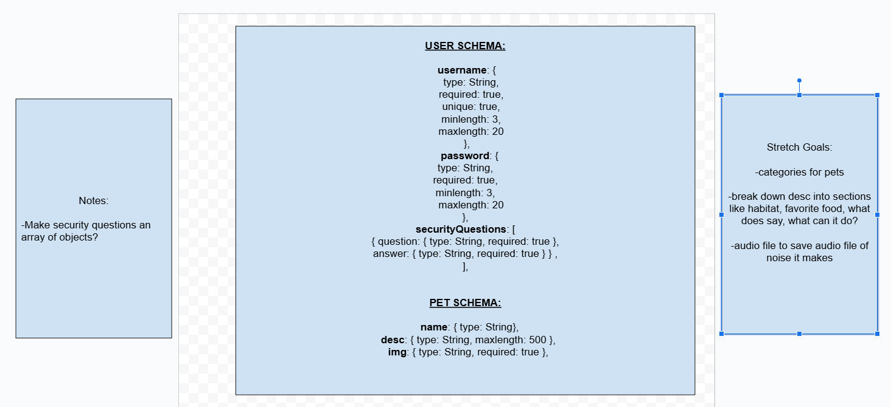
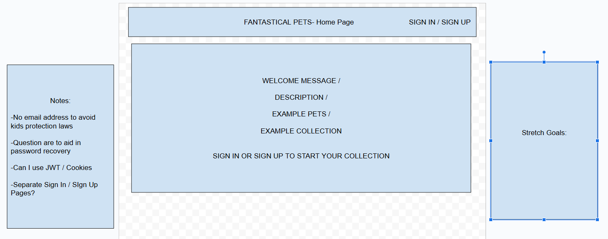
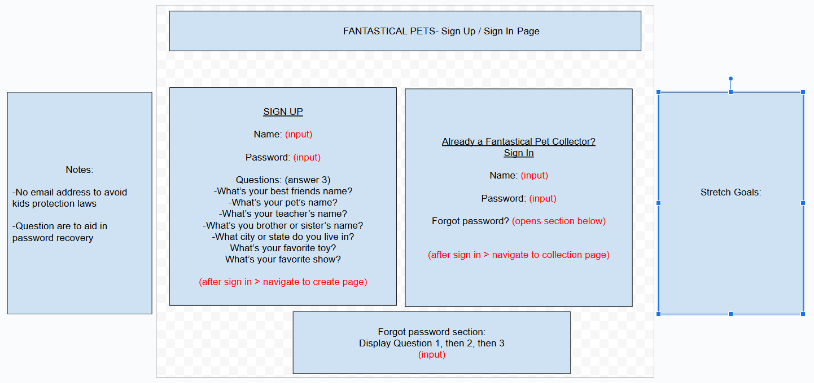
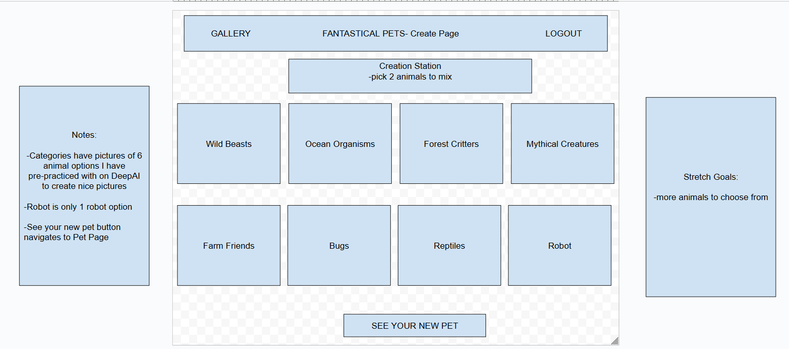
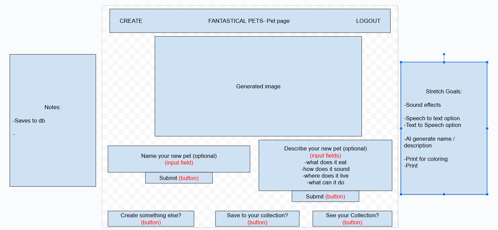
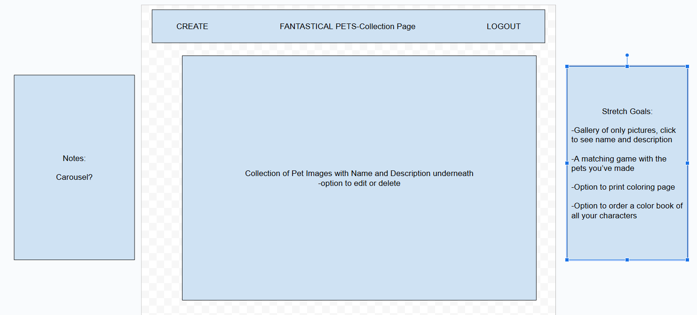

# Hafa Adai 🌻🐡

## Welcome to my Capstone project for my Per Scholas Software Development 16 week bootcamp 🎊

### In order to showcase all of the skills I've learned on this journey, I have developed a full stack web app game for kids called Fantastical Pets. It allows users to choose 2 creatures and morph them into one cute critter. They can decide if they want to give their new pet a name and / or description. They can also add it to their collection see a gallery of all the pets they've created.

### Link to backend: https://github.com/geiselleholt/FantasicalPetsBackEnd

### Objectives of the capstone:

### Requirements

### Tools I used for Frontend:
- vite
- axios
- useState, useEffect from react
- useNavigate, BrowserRouter from react-router-dom

### Acknowledgements
- DeepAi API: https://deepai.org/docs#apis

### Wire Frames:
Data Structure:

Home Page:

Sign In / Sign Up Page:

Create Page:

Pet Page:

Collection Page:

